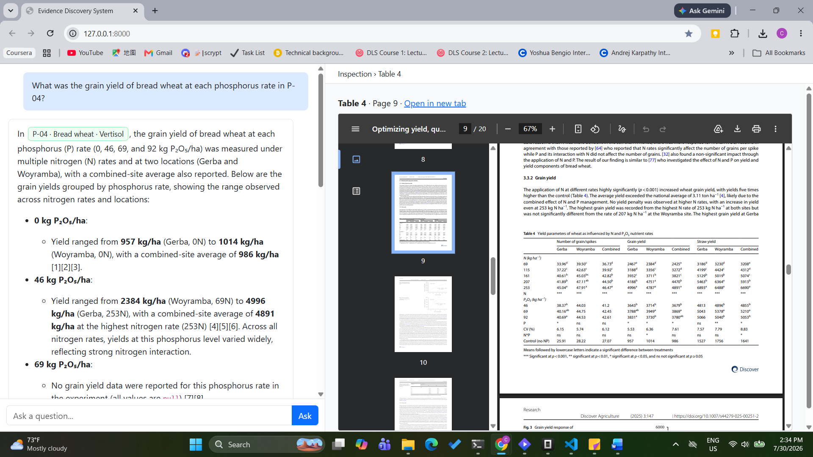
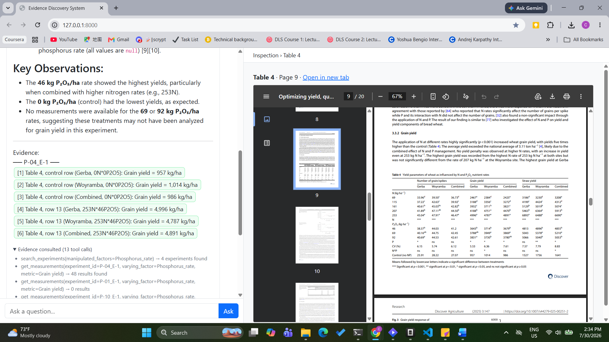

# evidence-store

A tool-gated question-answering system over structured experimental evidence extracted from scientific papers. Every number in a response is retrieved from a database by a deterministic tool — never generated by the LLM — and traces back to a specific source table and PDF page.

Two conversations side by side. Both show the desired output structure: the assistant's prose plus the appended **evidence block**, in which every cited measurement is grouped under its source and labeled `[N] M-XXXX`.





## Why

LLMs, left to their own devices, produce numbers that feel correct but are fabricated. When asked for a specific yield value, the model draws from its training distribution — which includes thousands of papers — and produces something locally plausible and impossible to verify.

This system prevents that by architecture, not by prompting:

- Measurements live in a structured store, accessed only through deterministic tools
- The LLM's role is limited to calling tools and composing narratives from their outputs
- Every cited measurement is validated against the tool results from that conversation
- Numbers without a tool trace are removed from the response

## Key Features

- **Tool-gated retrieval** — the LLM can only access evidence through `search_experiments`, `get_measurements`, `get_experiment_schema`, and related functions. No parametric-knowledge path into the output.
- **Canonical Evidence Representation (CER)** — papers are extracted into a normalized schema of experiments, observations, and measurements, preserving provenance at every level.
- **Source-page provenance** — every measurement knows its table, page, and paper. Citable values link directly to the PDF page they were extracted from.
- **Evidence validation** — each response's evidence block is checked against the tool results from that turn. Invalid citations are stripped.

## Architecture

```
PDFs → Extraction → CER → Evidence Store → Scientific Tools → Grounded Assistant
```

| Stage | Description |
|---|---|
| Extraction | PDF tables parsed into structured observations: treatment factors, levels, measured outcomes, provenance |
| CER | Observations normalized into a common schema — factors as typed dimensions, outcomes as metric-value-unit triples |
| Evidence Store | Queryable database (DuckDB) organized around experiments, observations, measurements, and evidence sources |
| Scientific Tools | Deterministic functions returning only records that exist in the database |
| Grounded Assistant | LLM restricted to tool calls; output post-processed so every cited value passes validation |

## Getting Started

```bash
# Install dependencies
pip install -r requirements.txt

# Set your API key (reads from env, never hardcoded)
# Windows PowerShell:
$env:OPENAI_API_KEY = "your-key"
# or
$env:MISTRAL_API_KEY = "your-key"

# Start the web server (from the repo root)
python -m src.evidence_store.server
# → http://localhost:8000

# Or use the CLI
python scripts/ask.py "What was the grain yield at each phosphorus rate in P-04?"
python scripts/ask.py --interactive
```

The repository includes a pre-built evidence store (`data/evidence_store_v3.duckdb`) with ~1,500 measurements extracted from ten Ethiopian papers on phosphorus and nitrogen management, so the system runs out of the box.

## Current Scope

- 10 papers, ~1,500 measurements, 42 source tables
- Domain: fertilizer response (phosphorus, nitrogen) on bread wheat, faba bean, and tef
- Within-experiment, single-factor questions are handled reliably
- Cross-study synthesis and multi-factor queries expose an open problem: the LLM's prose can still introduce numbers no tool returned

## Notes on the Data

The raw PDFs and intermediate extraction artifacts are **not** included in this repository. They are the copyrighted property of their respective publishers. Only the extracted, structured evidence store (numeric measurements and their provenance) is committed, which is sufficient to run the system.
